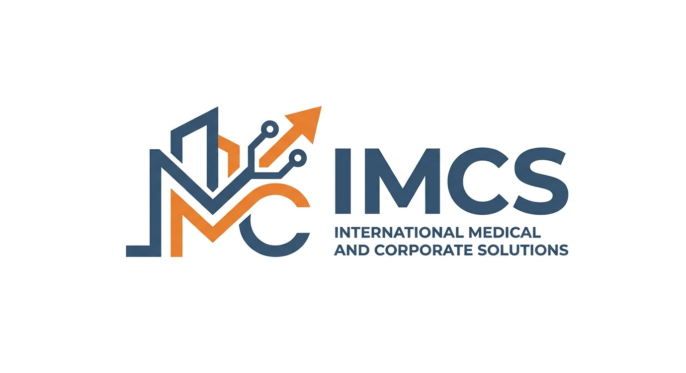

  <h1>🏢 IMCS Tech</h1>
  
  
<b>División de Innovación y Desarrollo Tecnológico</b>

  
<i>Construyendo la infraestructura digital del ecosistema corporativo IMCS.</i>

---

### 🌐 Sobre Nosotros

**IMCS Tech** es el motor tecnológico detrás del grupo empresarial IMCS. Diseñamos, desarrollamos y escalamos soluciones digitales que dan soporte no solo a nuestras plataformas de educación médica en nuestras sedes de Guayaquil, Ambato y Quito, sino a todas las divisiones del grupo: **Salud, Legal, Construcción, Marketing y Ventas corporativas**.

Nuestro enfoque es aplicar código limpio, arquitecturas robustas y diseños centrados en el usuario para optimizar procesos, tanto a nivel interno como para nuestros clientes.

---

### ⚙️ Áreas de Especialidad

Como división tecnológica integral, abarcamos el ciclo completo de las necesidades de IT:

- **Desarrollo de Software:** Creación de aplicaciones web, plataformas de E-Learning y sistemas de gestión a medida.
- **Desarrollo Web:** Diseño UI/UX y despliegue de portales corporativos eficientes y escalables.
- **Infraestructura y Soporte IT:** Mantenimiento de redes, servidores y asistencia técnica continua.
- **Hardware:** Asesoría, ensamblaje y distribución especializada de equipos y componentes de alto rendimiento.

---

### 🚀 Proyectos Estratégicos

Nuestras soluciones impulsan la operatividad del grupo a través de proyectos clave en activo desarrollo:

* **Portal Corporativo IMCS:** Web centralizada que unifica y presenta todos los servicios y divisiones del grupo.
* **IMCS E-Learning:** Plataforma educativa de alto rendimiento diseñada específicamente para la formación en ecografía.
* **Viper:** Aplicación web de gestión operativa y control de procesos internos.

---

### 👨‍💻 Equipo de Ingeniería

La arquitectura y ejecución de nuestros proyectos está liderada por nuestro equipo core Full Stack:

<table align="center">
  <tr>
    <td align="center" width="250px">
      <a href="https://github.com/justdeviii">
         
        <b>Abrahan (justdeviii)</b>
      </a> 
      <i>Frontend Lead / Full Stack Developer</i>
    </td>
    <td align="center" width="250px">
      <a href="https://github.com/nexxii04">
         
        <b>Buba (nexxii04)</b>
      </a> 
      <i>Backend Architect / Full Stack Developer</i>
    </td>
  </tr>
</table>

---

### 🛠️ Stack Tecnológico

Nuestra infraestructura se apoya en tecnologías modernas, seguras y de alta disponibilidad:

  <b>Frontend & UI:</b> 
  
  
  
  
  

  <b>Backend & Bases de Datos:</b> 
  
  
  
  
  
  
  

  <b>Infraestructura & Herramientas:</b> 
  
  

---

  
<i>IMCS Soft © 2026. Innovación digital al servicio del crecimiento corporativo.</i>

